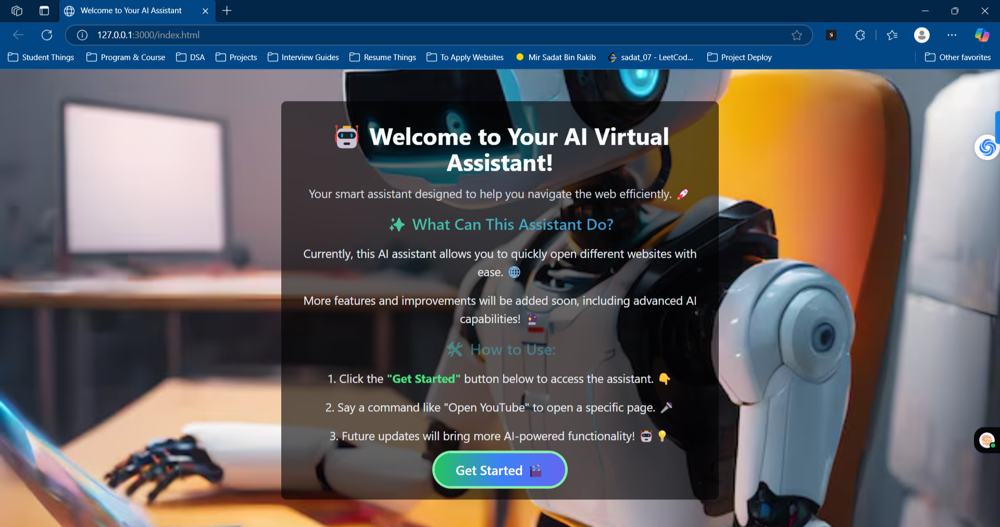

## Web-AI-Assistant 🤖

A Voice-Controlled Web Assistant for Seamless Task Execution! 🎙️💡

## Overview 🚀

My Virtual AI Assistant is a browser-based, voice-controlled assistant that helps users perform everyday tasks with simple voice commands. Whether it's opening websites, performing searches, or enhancing accessibility, this assistant is built to make interactions faster and smoother.

## Features 🌟

✅ Voice Recognition – Command the assistant with your voice!
✅ Speech Synthesis – Get real-time AI-generated voice feedback
✅ Smart Navigation – Open popular websites like YouTube, Google, LinkedIn & more
✅ Google Search Integration – Automatically search for unknown commands
✅ Dynamic UI – Beautiful glassmorphism-inspired design with Tailwind CSS
✅ Fast & Lightweight – Optimized for performance across all browsers

## How It Works 🎯

Click the "Start Listening" button 🎙️

Say a command (e.g., "Open YouTube")

Watch the assistant execute your request! 🚀

## 📸 Screenshots

## Tech Stack 🛠️

HTML – Structure & Content

Tailwind CSS – Styling & UI Enhancements

JavaScript (Web Speech API) – Voice Recognition & AI Responses

## Installation & Setup 📦

Clone the repository and open the index.html file in your browser.

# Clone this repository
git clone https://github.com/Sadat-Rakib/Web-AI-Assistant.git

# Navigate to the project folder
cd ai-virtual-assistant

# Open in browser
start index.html (Windows)  
open index.html (Mac)  

## Live Demo 🔥

Check out the live demo here: https://sadat-rakib.github.io/Web-AI-Assistant/

## Sample Voice Commands 🎤

Command	Action

"Open YouTube"	Opens YouTube in a new tab
"Open Google"	Opens Google search page
"Search for [query]"	Performs a Google search for the given query
"Open Twitter"	Opens Twitter
"Open GitHub"	Opens GitHub

## Future Improvements 🚀

🔹 Support for more commands (e.g., open calculator, weather updates)
🔹 Multi-language support
🔹 Dark mode and customizable themes
🔹 AI-powered chatbot integration

##  Author 👨‍💻

Developed with ❤️ by Mir Sadat Bin Rakib

## License 📜

This project is licensed under the MIT License - feel free to contribute and improve it!

## 🔗 Star this repo ⭐ if you found it useful, and feel free to fork & contribute! 🚀
